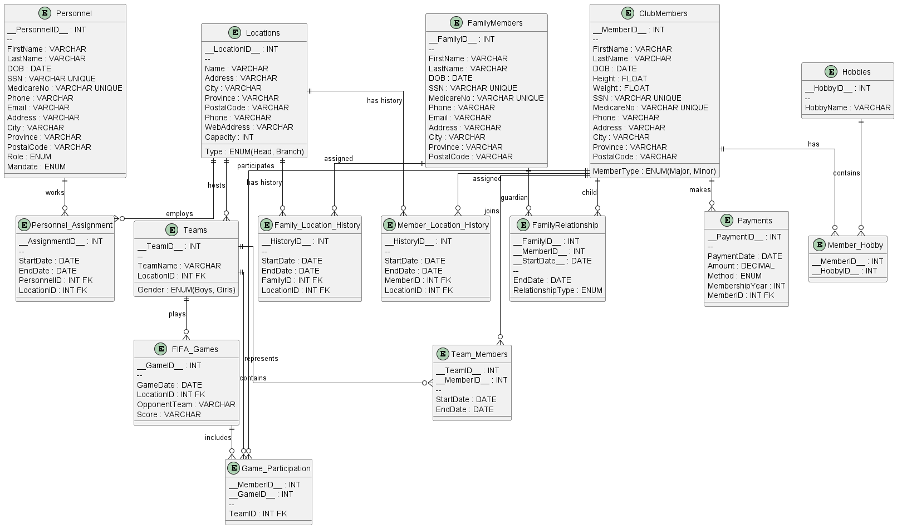

# Country Soccer Club System (CSCS)


# COMP 353 – Databases  
## Summer 2026 Warm-up Project


---

# 1. Project Overview

The **Country Soccer Club System (CSCS)** is a relational database application developed for a nonprofit soccer organization.

The objective of this project is to design and implement a complete database system capable of managing the daily operations of a soccer club, including members, locations, personnel, teams, family relationships, payments, hobbies, and FIFA game participation.

The system was designed using:

- Entity-Relationship (E/R) modeling
- Relational schema conversion
- MySQL database implementation
- SQL queries and transactions


The database supports:

- Club headquarters and branch management
- Personnel employment history tracking
- Major and minor member registration
- Family member and guardian relationships
- Member location history
- Team organization
- Hobby management
- Membership payment tracking
- FIFA game participation records


---

# 2. Project Objectives

The main objectives of this project are:

- Design an appropriate E/R model for the CSCS system.
- Convert the E/R model into normalized relational tables.
- Implement the database using MySQL 8.0.
- Maintain data integrity using keys and constraints.
- Populate tables with representative data.
- Develop SQL queries required by the project specification.


---

# 3. Technologies Used


| Technology | Purpose |
|---|---|
| MySQL 8.0 | Database Management System |
| MySQL Workbench | SQL execution and testing |
| Visual Studio Code | SQL and documentation development |
| PlantUML | ER Diagram generation |
| Markdown | Project documentation |


---

# 4. Project Structure


CSCS-Database

│
├── README.md
│
├── ER_Diagram
│ ├── CSCS_ER_Diagram.puml
│ └── CSCS_ER_Diagram.png
│
├── Relational_Schema.md
│
└── SQL
│
├── create_database.sql
│
├── Locations.sql
├── Personnel.sql
├── Personnel_Assignment.sql
├── ClubMembers.sql
├── FamilyMembers.sql
├── FamilyRelationship.sql
├── Family_Location_History.sql
├── Member_Location_History.sql
├── Hobbies.sql
├── Member_Hobby.sql
├── Payments.sql
├── Teams.sql
├── Team_Members.sql
├── FIFA_Games.sql
├── Game_Participation.sql
│
└── queries
├── Query_1.sql
├── Query_2.sql
├── Query_3.sql
├── Query_4.sql
├── Query_5.sql
├── Query_6.sql
├── Query_7.sql
└── Query_8.sql


---

# 5. Entity Relationship Diagram


The database conceptual design was created using PlantUML.

The ER diagram represents:

- Entities
- Attributes
- Primary keys
- Foreign keys
- Relationship constraints





Source file:


ER_Diagram/CSCS_ER_Diagram.puml


---

# 6. Database Schema


The CSCS database consists of the following main relations:


## Locations

Stores information about club headquarters and branches.

Attributes include:

- Location ID
- Name
- Type (Head / Branch)
- Address
- City
- Province
- Postal code
- Phone number
- Website
- Capacity


---

## Personnel

Stores information about all employees and volunteers.

Examples:

- General Manager
- Administrator
- Coach
- Captain
- Assistant Coach


Maintained information:

- Personal information
- Contact information
- SSN
- Medicare number
- Role
- Employment mandate


---

## Club Members

Stores all registered soccer club members.

Two categories are supported:


### Major Members

Members aged:


18 years old or above


### Minor Members

Members aged:


4 - 17 years old


Stored information:

- Membership number
- Name
- Date of birth
- Height
- Weight
- Contact information
- Member type


---

## Family Members

Stores parents, guardians, and other family members associated with minor members.


---

## Payments

Maintains membership payment information:

- Payment date
- Amount
- Payment method
- Membership year


Payment methods:

- Cash
- Debit
- Credit Card


---

## Teams and FIFA Games

The database manages:

- Boys teams
- Girls teams
- Team membership
- FIFA game participation
- Opponents
- Scores
- Game dates


---

# 7. Database Installation


## Step 1: Create Database


Open MySQL Workbench:


```sql
CREATE DATABASE CSCS;

USE CSCS;

or execute:

SQL/create_database.sql
Step 2: Create Tables

Execute all table creation scripts inside:

SQL/

The database includes:

Primary keys
Foreign keys
Unique constraints
ENUM constraints
Step 3: Insert Data

Insert data following dependency order:

Locations
Personnel
Club Members
Family Members
Hobbies
Personnel Assignment
Member Location History
Family Location History
Family Relationship
Teams
Team Members
Member Hobby
Payments
FIFA Games
Game Participation

Each relation contains representative tuples for testing.

8. SQL Queries

The project contains eight required queries:

Query 1

Retrieve complete information for every location:

Includes:

Location details
General manager
Number of personnel
Number of members
Number of FIFA participants
Query 2

Retrieve major members who participated in FIFA games.

Includes:

Location
Membership number
Name
Age
Status
Number of games played
Query 3

Retrieve members with at least four hobbies.

Query 4

Retrieve major members who never participated in FIFA games.

Query 5

Generate age statistics:

Age -> Number of members
Query 6

Retrieve major members who are also family members and their associated children.

Query 7

Calculate:

Total membership fees
Total donations

between:

2023 - 2025
Query 8

Retrieve members who participated in at least four FIFA games.

9. Data Integrity

The database enforces:

Primary Keys

Examples:

LocationID
PersonnelID
MemberID
TeamID
GameID
Unique Constraints

Applied to:

Social Security Number
Medicare Card Number
Foreign Keys

Examples:

Payments -> ClubMembers

Game_Participation -> FIFA_Games

Team_Members -> Teams
Historical Relationships

The database maintains:

Personnel working history
Member location history
Family relationships
Team participation history
10. Testing

Each relation was tested using:

SELECT COUNT(*) FROM TableName;

The database contains sufficient data to execute all required project queries.

11. Contributors
COMP353 Database Project Group

Concordia University

Summer 2026

12. Conclusion

The Country Soccer Club System database provides a complete relational database solution for managing soccer club operations.

The project demonstrates:

Database modeling
ER diagram design
Relational schema conversion
MySQL implementation
SQL query development
Data integrity management

The final system satisfies the requirements specified in the COMP 353 Database course project.
